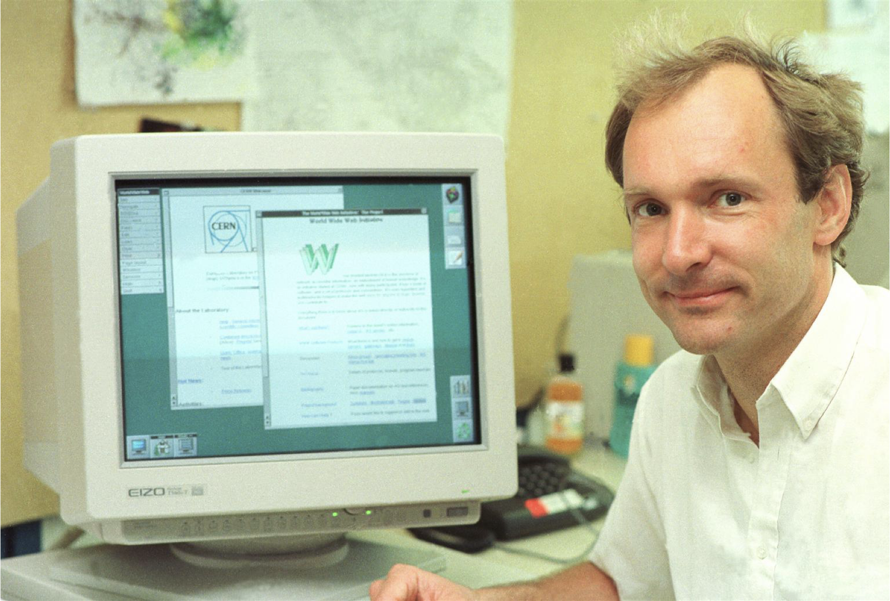

# Sample Presi {layout="title"}

---

# Slide One

- This is a simple slide
- It just has bullets
- It's boring, but it works.
- Time for more fun

---

# Slide Two


- This slide has a picture
- There are also bullets
- They should be side by side

---

# Slide 3

### Some Bullets

- Thing 1
- Thing 2
- Thing 3

### A Table

| Row Number | Thing    |
|------------|----------|
| 1          | Parsley  |
| 2          | Sage     |
| 3          | Rosemary |
| 4          | Thyme    |

---

# Slide 4

### Revealed Section 

- Secret {.reveal}
- Top Secret
- Super Top Secret

### Static Section

- You can see this
- if you want
- nothing special here

---
# Slide 5

 {.full}

---
# Slide 6 


{.full}

<!-- symmetry between Request and Response -->

|    | Request  | Response |
| --- | --- | --- |
| Start | `GET /en-US/docs/… HTTP/1.1` | `HTTP/1.1 404 Not Found` |
| Headers | `User-Agent: Mozilla/5.0…` | `Content-Type: application/json` |
| Body | `<!DOCTYPE html> <html lang="en"> … </html>` | `{"squadName": "SuperHeroSquad", …}`  |

---

# Slide 7

<aside>



> Cool URIs don't change {.full}
> 
> —Tim Berners-Lee {.attribution}


</aside>

- A resource's URL should never change
- Resource itself may change
- Physical storage location may change
  - Client shouldn't care

---


# Slide 7

```HTML {.full}
<a href="http://example.com/other.html"/>Some other page</a>`
```
	

### Syntax
- `a` is for **A**nchor
- `href` attribute
  - value is a URL (as defined by HTTP)
- Content model: mixed content 

### Semantics
- creates a hyperlink to web pages, files, email addresses, locations in the same page, or anything else a URL can address
- Default behavior:
  - load the referenced resource

---
# Slide 8


> View is a function of Model 

- To modify the view, change the model
- `render()`  is a function
- Performance is enhanced by reducing full re-renders


---
tags: #slides